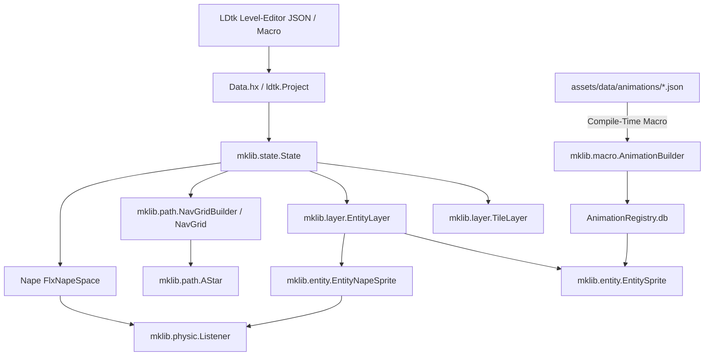

# mklib – Dokumentation & API-Referenz

**`mklib`** ist eine performante Haxe-Bibliothek zur nahtlosen Verbindung von **HaxeFlixel**, dem Level-Editor **LDtk** und der 2D-Physik-Engine **Nape**. Sie bietet Werkzeuge für automatische Level- und Entity-Instanziierung, ein unkompliziertes Physik- und Sensor-System sowie integriertes A*-Pathfinding mit Multi-Tile-Unterstützung.

---

## 📚 Inhaltsverzeichnis & Module

1. [**Schnellstart & Einrichtung**](getting_started.md)
   - Installation & Haxelib-Abhängigkeiten
   - LDtk-Makro-Setup (`Data.hx`)
   - Erster `PlayState` und Spielstart
2. [**State-Management (`mklib.state.State`)**](state.md)
   - Eigenschaften: `project`, `tags`, `levelName`, `data`
   - Methoden: `new`, `create`, `napeInit`, `addCbTypes`, `update`
3. [**Layer-System (`mklib.layer.*`)**](layers.md)
   - `TileLayer`: Rendern von LDtk-Kachelebenen (`new`, `render`)
   - `EntityLayer`: Dynamische Instanziierung von Spielobjekten via Reflection (`new`, `addEntities`)
   - `EntityLayerSource<T>`: Typedef für Entity-Layer-Quellen
4. [**Entities & Spielobjekte (`mklib.entity.*`)**](entities.md)
   - `EntitySprite`: Basisklasse für visuelle Sprites (`_entity`, `iid`, `state`, `new`)
   - `EntityNapeSprite`: Physikalische Körper, automatische LDtk-Tags und Form-Zentrierung (`addCbType`, `updateShapePosition`)
5. [**Physik & Sensoren (`mklib.physic.*` & `mklib.tools.Tags`)**](physics.md)
   - `Listener`: 9 Methoden für Kollisionen (`COLLISION`) und Sensoren (`SENSOR`) mit `BEGIN`, `END`, `ONGOING`, `ANY_BODY`
   - `Tags`: Zentraler Zugriff auf CbTypes (`get`, `exist`)
6. [**Pathfinding & Navigation (`mklib.path.*`)**](pathfinding.md)
   - `NavGrid`: 2D-Raster auf 1D-Array-Basis (4 Eigenschaften, 12 Methoden)
   - `NavGridBuilder`: Automatisches Level-Scanning aus IntGrid, Tiles & Entities
   - `AStar` & `GridPoint`: 4-Wege- & 8-Wege-Pfadsuche für Einheiten beliebiger Kachelgröße
7. [**Tools & Mathematik (`mklib.tools.*` & `mklib.math.*`)**](tools_math.md)
   - `AspectRatio`: Dynamische Bildschirmauflösung & Skalierung (`width`, `height`, `isDefault`, `isInRange`)
   - `MathTool`: Hilfsfunktionen zur Rundung (`floatFix`)
8. [**Animationssystem & Makros (`mklib.animation.*` & `mklib.macro.*`)**](animation.md)
   - `AnimationBuilder`: Compile-Time-Makro zum Einlesen von JSON-Animationen (`buildDatabase`)
   - `AnimationTypes`: Datenstrukturen (`FrameConfig`, `AnimationClip`, `SpriteSheetData`)
   - `AnimationRegistry`: Globales Bereitstellungsmuster für Entity-Animationen

---

## 🏛️ Vollständige API-Matrix

| Modul / Paket | Klasse / Typ | Eigenschaften | Methoden |
| :--- | :--- | :--- | :--- |
| `mklib.state` | `State<TLevel>` | `project`, `tags`, `levelName`, `data` | `new`, `create`, `addCbTypes`, `napeInit`, `update` |
| `mklib.layer` | `TileLayer` | `levelName`, `layerName`, `state` | `new`, `render` |
| `mklib.layer` | `EntityLayer` | `layerName`, `packageName`, `state` | `new`, `addEntities` |
| `mklib.layer` | `EntityLayerSource<T>` | `identifier`, `getAllUntyped` | – |
| `mklib.entity` | `EntitySprite` | `_entity`, `iid`, `state`, `graphicPath`, `hasGraphic` | `new`, `getGraphicPath`, `getField`, `hasField`, `initAnimation` |
| `mklib.entity` | `EntityNapeSprite` | `_entity`, `iid`, `state`, `graphicPath`, `hasGraphic`, `body` | `new`, `getGraphicPath`, `getField`, `hasField`, `sensorEnabled`, `addCbType`, `updateShapePosition`, `initAnimation` |
| `mklib.animation` | `FrameConfig` | `width`, `height`, `spacing`, `margin` | – |
| `mklib.animation` | `AnimationClip` | `name`, `fps`, `loop`, `flipX`, `flipY`, `frames` | – |
| `mklib.animation` | `SpriteSheetData` | `imagePath`, `config`, `animations`, `defaultAnimation` | – |
| `mklib.macro` | `AnimationBuilder` | – | `buildDatabase` |
| `mklib.physic` | `Listener` | – | `addCollisionBeginListener`, `addCollisionEndListener`, `addCollisionOngoingListener`, `addSensorBeginListener`, `addSensorEndListener`, `addSensorOngoingListener`, `addSensorBeginListenerANY`, `addSensorEndListenerANY`, `addSensorOngoingListenerANY` |
| `mklib.tools` | `Tags` | – | `get`, `exist` |
| `mklib.path` | `NavGrid` | `width`, `height`, `gridSize`, `data` | `new`, `isInBounds`, `getIndex`, `get`, `set`, `isWalkable`, `isAreaWalkable`, `setArea`, `setEntity`, `worldToGridX`, `worldToGridY`, `gridToWorldX`, `gridToWorldY`, `clear`, `clone`, `toString` |
| `mklib.path` | `NavGridBuilder` | `grid`, `level` | `new`, `fromLevel`, `addIntGrid`, `addTileLayer`, `addEntityLayer`, `addLayerByName`, `autoBuild`, `build` |
| `mklib.path` | `AStar` | `SQRT2` | `findPath`, `findWorldPath`, `heuristic`, `reconstructPath` |
| `mklib.path` | `GridPoint` | `x`, `y` | `new`, `equals`, `toString` |
| `mklib.tools` | `AspectRatio` | `width`, `height`, `isDefault`, `screenRatio` | `new`, `calc`, `isInRange` |
| `mklib.math` | `MathTool` | – | `floatFix` |

---

## 🏗️ Architektur

