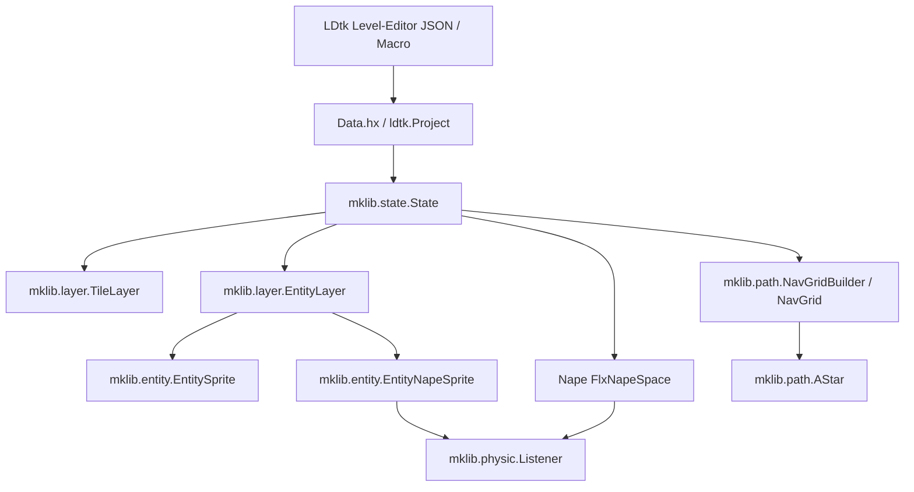

# mklib – Dokumentation & API-Referenz

**`mklib`** ist eine performante Haxe-Bibliothek zur nahtlosen Verbindung von **HaxeFlixel**, dem Level-Editor **LDtk** und der 2D-Physik-Engine **Nape**. Sie bietet Werkzeuge für automatische Level- und Entity-Instanziierung, ein unkompliziertes Physik- und Sensor-System sowie integriertes A*-Pathfinding mit Multi-Tile-Unterstützung.

---

## 📚 Inhaltsverzeichnis

1. [**Schnellstart & Einrichtung**](getting_started.md)
   - Installation & Haxelib-Abhängigkeiten
   - LDtk-Makro-Setup (`Data.hx`)
   - Erster `PlayState` und Spielstart
2. [**State-Management (`mklib.state.State`)**](state.md)
   - Automatische Level-Auflösung
   - Nape-Physik-Initialisierung (`napeInit`)
   - Tag- und CbType-Verwaltung
3. [**Layer-System (`mklib.layer.*`)**](layers.md)
   - `TileLayer`: Rendern von LDtk-Kachelebenen
   - `EntityLayer`: Dynamische Instanziierung von Spielobjekten via Reflection
4. [**Entities & Spielobjekte (`mklib.entity.*`)**](entities.md)
   - `EntitySprite`: Basisklasse für visuelle Sprites
   - `EntityNapeSprite`: Physikalische Körper, automatische LDtk-Tags und Form-Zentrierung
5. [**Physik & Sensoren (`mklib.physic.*` & `mklib.tools.Tags`)**](physics.md)
   - `Listener`: Kollisionen (`COLLISION`) und Sensoren (`SENSOR`)
   - Ereignisse: `BEGIN`, `END`, `ONGOING` und `ANY_BODY`
   - `Tags`: Zentraler Zugriff auf CbTypes
6. [**Pathfinding & Navigation (`mklib.path.*`)**](pathfinding.md)
   - `NavGrid`: 2D-Raster auf 1D-Array-Basis
   - `NavGridBuilder`: Automatisches Level-Scanning aus IntGrid, Tiles & Entities
   - `AStar`: 4-Wege & 8-Wege Pfadsuche für Einheiten beliebiger Kachelgröße
7. [**Tools & Mathematik (`mklib.tools.*` & `mklib.math.*`)**](tools_math.md)
   - `AspectRatio`: Dynamische Bildschirmauflösung & Skalierung
   - `MathTool`: Hilfsfunktionen zur Rundung (`floatFix`)

---

## 🏗️ Architektur & Überblick



---

## 🚀 Minimalbeispiel

```haxe
package;

import flixel.FlxG;
import mklib.state.State;
import mklib.layer.TileLayer;
import mklib.layer.EntityLayer;
import mklib.path.NavGridBuilder;
import mklib.path.NavGrid;

class PlayState extends State<Data.Data_Level> {
    public var tileLayer:TileLayer;
    public var entityLayer:EntityLayer;
    public var navGrid:NavGrid;

    override public function create() {
        super.create();

        // 1. Nape-Physik mit Schwerkraft initialisieren
        napeInit(0, 300);

        // 2. Kachelebene laden und zeichnen
        tileLayer = new TileLayer(data.l_Tiles.identifier);
        add(tileLayer);

        // 3. Entities automatisch instanziieren (sucht in "entities.*")
        entityLayer = new EntityLayer(data.l_Entities);
        add(entityLayer);

        // 4. Navigationsraster automatisch aus allen Layern des Levels erzeugen
        navGrid = NavGridBuilder.autoBuild(data);
    }
}
```
