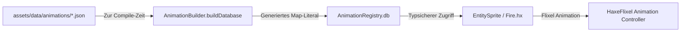

# Animationssystem & Makros (`mklib.animation.*` & `mklib.macro.*`)

`mklib` enthält ein automatisiertes, makro-basiertes Animationssystem zur schnellen und typsicheren Einbindung von Spritesheet-Animationen. JSON-Animationsdefinitionen werden zur Compile-Zeit eingelesen, normalisiert und in eine globale typisierte `Map<String, SpriteSheetData>` kompiliert – ohne manuelles Parsen zur Laufzeit.

---

## 🏗️ Architektur & Funktionsweise



1. **JSON-Animationsdateien** definieren Kachelgrößen, Bilddateipfade und Animationsclips.
2. **`AnimationBuilder.buildDatabase`** liest zur Compile-Zeit alle `.json`-Dateien aus dem Projektverzeichnis, bereinigt absolute Pfade in relative `assets/...`-Pfade und baut eine vorkompilierte `Map`.
3. **`AnimationRegistry.db`** stellt alle geladenen `SpriteSheetData`-Objekte zur Laufzeit blitzschnell zur Verfügung.
4. **Entities** wie `Fire.hx` rufen ihre Animationsdaten über das LDtk-Feld (`getField("Animations")`) aus der Registry ab und weisen sie Flixel zu.

---

## 📄 JSON-Dateiformat (`assets/data/animations/*.json`)

Jede Animationsdatei beschreibt ein Spritesheet und beliebig viele Animationsphasen:

```json
{
  "imagePath": "C:\\Users\\...\\assets\\tilesets\\Fire.png",
  "config": {
    "width": 16,
    "height": 16,
    "spacing": 0,
    "margin": 0
  },
  "animations": [
    {
      "name": "burn",
      "fps": 10,
      "loop": true,
      "flipX": false,
      "flipY": false,
      "frames": [0, 1, 2, 3]
    }
  ],
  "defaultAnimation": "burn"
}
```

> [!NOTE]
> Das Makro `AnimationBuilder` wandelt absolute Pfade in `imagePath` automatisch in relative Pfade beginnend mit `assets/` um.

---

## 🧩 Datenstrukturen (`mklib.animation.AnimationTypes`)

### 1. `FrameConfig`
Beschreibt das Kachel-Layout des Spritesheets.

| Eigenschaft | Typ | Optional | Beschreibung |
| :--- | :--- | :--- | :--- |
| `width` | `Int` | Nein | Breite eines einzelnen Frames in Pixeln. |
| `height` | `Int` | Nein | Höhe eines einzelnen Frames in Pixeln. |
| `spacing` | `Int` | Ja | Abstand zwischen benachbarten Frames in Pixeln (Standard: `0`). |
| `margin` | `Int` | Ja | Äußerer Rand des Spritesheets in Pixeln (Standard: `0`). |

### 2. `AnimationClip`
Definiert einen konkreten Animationsablauf.

| Eigenschaft | Typ | Optional | Beschreibung |
| :--- | :--- | :--- | :--- |
| `name` | `String` | Nein | Eindeutiger Bezeichner des Clips (z. B. `"burn"`, `"idle"`, `"walk"`). |
| `fps` | `Int` | Nein | Abspielgeschwindigkeit in Frames pro Sekunde. |
| `loop` | `Bool` | Nein | Gibt an, ob die Animation in Endlosschleife läuft. |
| `flipX` | `Bool` | Nein | Horizontale Spiegelung der Frames. |
| `flipY` | `Bool` | Nein | Vertikale Spiegelung der Frames. |
| `frames` | `Array<Int>` | Nein | Array der Frame-Indizes auf dem Spritesheet. |

### 3. `SpriteSheetData`
Vollständiger Datensatz eines animierten Spritesheets.

| Eigenschaft | Typ | Optional | Beschreibung |
| :--- | :--- | :--- | :--- |
| `imagePath` | `String` | Nein | Normalisierter Asset-Pfad zur Bilddatei (z. B. `"assets/tilesets/Fire.png"`). |
| `config` | `FrameConfig` | Nein | Kachel- und Rastereinstellungen des Spritesheets. |
| `animations` | `Array<AnimationClip>` | Nein | Liste aller definierten Clips. |
| `defaultAnimation` | `String` | Nein | Name der Standardanimation, die direkt abgespielt werden soll. |

---

## ⚙️ Makro-Kompilierung (`mklib.macro.AnimationBuilder`)

### Methoden

| Methode | Signatur | Rückgabewert | Beschreibung |
| :--- | :--- | :--- | :--- |
| `buildDatabase` | `(folderPath:String):Expr` | `Expr` *(Makro)* | Scannt das Verzeichnis zur Compile-Zeit nach `.json`-Dateien, parst die Daten und erzeugt ein typisiertes `Map<String, SpriteSheetData>`-Literal. Der Schlüssel entspricht dem Dateinamen ohne Erweiterung (z. B. `"Fire"`). |

### Setup der `AnimationRegistry` (`source/AnimationRegistry.hx`)

```haxe
package;

import mklib.animation.AnimationTypes;
import mklib.macro.AnimationBuilder;

class AnimationRegistry {
    // Liest alle JSON-Dateien aus "assets/data/animations" zur Compile-Zeit ein
    public static var db:Map<String, SpriteSheetData> = AnimationBuilder.buildDatabase("assets/data/animations");
}
```

---

## 🎮 Entity-Integration (`source/entities/Fire.hx`)

`EntitySprite` (und `EntityNapeSprite`) binden das Animationssystem automatisch ein: Wenn im LDtk-Level das Feld `"Animations"` gesetzt ist, werden die passenden Animationsclips aus der `AnimationRegistry` geladen und registriert:

```haxe
package entities;

import mklib.entity.EntitySprite;
import ldtk.Entity;

/**
 * Visuelle animierte Feuer-Dekoration, die von EntitySprite erbt.
 */
@:keep
class Fire extends EntitySprite {
    public function new(entity:ldtk.Entity) {
        super(entity);
        // Animationen werden automatisch über initAnimation() im Konstruktor von EntitySprite geladen!
    }
}
```

Alternativ kann `initAnimation(?animKey:String)` jederzeit manuell aufgerufen werden:

```haxe
// Manuelles Laden / Wechseln der Animationen:
initAnimation("Fire");
```
