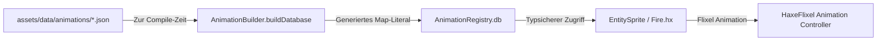

# Animationssystem & Makros (`mklib.animation.*` & `mklib.macro.*`)

`mklib` enthält ein automatisiertes, makro-basiertes Animationssystem zur schnellen und typsicheren Einbindung von Spritesheet-Animationen. JSON-Animationsdefinitionen werden zur Compile-Zeit eingelesen, normalisiert und in eine globale typisierte `Map<String, SpriteSheetData>` kompiliert – ohne manuelles Parsen zur Laufzeit.

---

## 🏗️ Architektur & Funktionsweise



1. **JSON-Animationsdateien** definieren Kachelgrößen, Bilddateipfade und Animationsclips.
2. **`AnimationBuilder.buildDatabase`** liest zur Compile-Zeit alle `.json`-Dateien aus dem Projektverzeichnis, bereinigt absolute Pfade in relative `assets/...`-Pfade und baut eine vorkompilierte `Map`.
3. **`AnimationRegistry.db`** stellt alle geladenen `SpriteSheetData`-Objekte zur Laufzeit blitzschnell zur Verfügung.
4. **Entities** wie `Fire.hx` rufen ihre Animationsdaten über das LDtk-Feld (`getField("Animations")`) aus der Registry ab und weisen sie Flixel zu.

---

## 📄 JSON-Dateiformat (`assets/data/animations/*.json`)

Jede Animationsdatei beschreibt ein Spritesheet und beliebig viele Animationsphasen:

```json
{
  "imagePath": "C:\\Users\\...\\assets\\tilesets\\Fire.png",
  "config": {
    "width": 16,
    "height": 16,
    "spacing": 0,
    "margin": 0
  },
  "animations": [
    {
      "name": "burn",
      "fps": 10,
      "loop": true,
      "flipX": false,
      "flipY": false,
      "frames": [0, 1, 2, 3]
    }
  ],
  "defaultAnimation": "burn"
}
```

> [!NOTE]
> Das Makro `AnimationBuilder` wandelt absolute Pfade in `imagePath` automatisch in relative Pfade beginnend mit `assets/` um.

---

## 🧩 Datenstrukturen (`mklib.animation.AnimationTypes`)

### 1. `FrameConfig`
Beschreibt das Kachel-Layout des Spritesheets.

| Eigenschaft | Typ | Optional | Beschreibung |
| :--- | :--- | :--- | :--- |
| `width` | `Int` | Nein | Breite eines einzelnen Frames in Pixeln. |
| `height` | `Int` | Nein | Höhe eines einzelnen Frames in Pixeln. |
| `spacing` | `Int` | Ja | Abstand zwischen benachbarten Frames in Pixeln (Standard: `0`). |
| `margin` | `Int` | Ja | Äußerer Rand des Spritesheets in Pixeln (Standard: `0`). |

### 2. `AnimationClip`
Definiert einen konkreten Animationsablauf.

| Eigenschaft | Typ | Optional | Beschreibung |
| :--- | :--- | :--- | :--- |
| `name` | `String` | Nein | Eindeutiger Bezeichner des Clips (z. B. `"burn"`, `"idle"`, `"walk"`). |
| `fps` | `Int` | Nein | Abspielgeschwindigkeit in Frames pro Sekunde. |
| `loop` | `Bool` | Nein | Gibt an, ob die Animation in Endlosschleife läuft. |
| `flipX` | `Bool` | Nein | Horizontale Spiegelung der Frames. |
| `flipY` | `Bool` | Nein | Vertikale Spiegelung der Frames. |
| `frames` | `Array<Int>` | Nein | Array der Frame-Indizes auf dem Spritesheet. |

### 3. `SpriteSheetData`
Vollständiger Datensatz eines animierten Spritesheets.

| Eigenschaft | Typ | Optional | Beschreibung |
| :--- | :--- | :--- | :--- |
| `imagePath` | `String` | Nein | Normalisierter Asset-Pfad zur Bilddatei (z. B. `"assets/tilesets/Fire.png"`). |
| `config` | `FrameConfig` | Nein | Kachel- und Rastereinstellungen des Spritesheets. |
| `animations` | `Array<AnimationClip>` | Nein | Liste aller definierten Clips. |
| `defaultAnimation` | `String` | Nein | Name der Standardanimation, die direkt abgespielt werden soll. |

---

## ⚙️ Makro-Kompilierung (`mklib.macro.AnimationBuilder`)

### Methoden

| Methode | Signatur | Rückgabewert | Beschreibung |
| :--- | :--- | :--- | :--- |
| `buildDatabase` | `(folderPath:String):Expr` | `Expr` *(Makro)* | Scannt das Verzeichnis zur Compile-Zeit nach `.json`-Dateien, parst die Daten und erzeugt ein typisiertes `Map<String, SpriteSheetData>`-Literal. Der Schlüssel entspricht dem Dateinamen ohne Erweiterung (z. B. `"Fire"`). |

### Setup der `AnimationRegistry` (`source/AnimationRegistry.hx`)

```haxe
package;

import mklib.animation.AnimationTypes;
import mklib.macro.AnimationBuilder;

class AnimationRegistry {
    // Liest alle JSON-Dateien aus "assets/data/animations" zur Compile-Zeit ein
    public static var db:Map<String, SpriteSheetData> = AnimationBuilder.buildDatabase("assets/data/animations");
}
```

---

## 🎮 Entity-Integration & Verwendung

### 1. LDtk-Workflow: Vorschau-Datei & das Enum `Animations` (Best Practice)

Um in LDtk direkt im Level-Editor eine visuelle Vorschau der platzierten animierten Entities zu sehen und Tippfehler zu vermeiden, empfiehlt sich folgender 4-Schritte-Workflow:

1. **Vorschau-Grafik anlegen (`assets/spritesheets/Animations.png`):**
   - Erstelle eine Spritesheet-Datei (z. B. 320×320 Pixel mit einem 32×32-Kachelraster), die für jedes Spritesheet bzw. jede Animations-Definition ein einzelnes Vorschaubild (z. B. Frame 0) als Kachel enthält.
   - *Beispiel:* Kachel `(0, 0)` = `Hero`, Kachel `(32, 0)` = `Warg`, Kachel `(64, 0)` = `Fire`.
2. **Tileset in LDtk einbinden:**
   - In LDtk unter *Project Settings &rarr; Tilesets* ein neues Tileset namens `Animations` anlegen.
   - Als Bilddatei `assets/spritesheets/Animations.png` auswählen und die Kachelgröße (z. B. 32×32) festlegen.
3. **Enum `Animations` mit Icon-Tileset konfigurieren:**
   - In LDtk unter *Project Settings &rarr; Enums* ein Enum namens `Animations` erstellen.
   - Bei **Icon tileset** das zuvor erstellte Tileset `Animations` auswählen.
   - Als Werte die exakten Dateinamen der JSON-Dateien aus `assets/data/animations/` eintragen (ohne `.json`, z. B. `Hero`, `Warg`, `Fire`).
   - Jedem Enum-Wert per Klick das passende Vorschaubild-Icon aus der Kachelgrafik zuweisen.
4. **Entity-Feld `Animations` definieren:**
   - Bei der Entity-Definition (z. B. `Hero` oder generischen Entities) ein Custom Field anlegen:
     - **Identifier:** `Animations` (oder `animations`)
     - **Type:** `Enum.Animations` (bzw. `LocalEnum.Animations`)
     - **Editor display mode:** `EntityTile` (oder `Cover` / `Above`)
   - Beim Platzieren der Entity im Level-Editor zeigt LDtk sofort das ausgewählte Vorschaubild direkt auf der Entity an!

> [!NOTE]
> **Automatisches Laden zur Laufzeit:**  
> `EntitySprite` und `EntityNapeSprite` prüfen im Konstruktor automatisch `hasField("Animations")`. Die temporäre Vorschaukachel aus `Animations.png` wird im Spiel automatisch ignoriert. Stattdessen lädt der `AnimationManager` das tatsächliche, vollständige Spritesheet aus der JSON-Datei (`assets/data/animations/<Name>.json`), registriert alle Clips und startet die Standard-Animation.

### 2. Automatisch im Code (`source/entities/Fire.hx`)

```haxe
package entities;

import mklib.entity.EntitySprite;
import ldtk.Entity;

/**
 * Visuelle animierte Feuer-Dekoration, die von EntitySprite erbt.
 */
@:keep
class Fire extends EntitySprite {
    public function new(entity:ldtk.Entity) {
        // super(entity) liest automatisch das LDtk-Enum-Feld "Animations"
        // und lädt die Clips aus AnimationRegistry.db bzw. assets/data/animations/!
        super(entity);
    }
}
```

### 3. Manuelles Laden / Wechseln auf Entities

`initAnimation(?animKey:String)` delegiert intern direkt an den `AnimationManager`:

```haxe
// Manuelles Laden / Wechseln der Animationen (z. B. "Fire", "Fire.json" oder Pfad):
myEntity.initAnimation("Fire");

// Clip manuell wechseln:
myEntity.animation.play("burn");
```

---

## 🛠️ Der `AnimationManager` (`mklib.animation.AnimationManager`)

Der `AnimationManager` kapselt das Laden der Grafik, die Registrierung aller Animationsclips und das Starten der Standardanimation an einer zentralen Stelle für beliebige `FlxSprite`-Instanzen:

### Methoden

| Methode | Signatur | Rückgabewert | Beschreibung |
| :--- | :--- | :--- | :--- |
| `apply` | `(sprite:FlxSprite, animKey:String, forceGraphic:Bool = true)` | `Bool` | Sucht `animKey` in `AnimationRegistry.db` (oder lädt die JSON zur Laufzeit aus `assets/data/animations/`), lädt die Grafik und registriert alle Clips auf `sprite`. |
| `applyData` | `(sprite:FlxSprite, data:SpriteSheetData, forceGraphic:Bool = true)` | `Bool` | Wendet ein `SpriteSheetData`-Objekt direkt auf `sprite` an und lädt das Spritesheet, falls nötig. |
| `cleanKey` | `(animKey:String)` | `String` | Normalisiert Eingaben (entfernt Verzeichnisse und die Endung `.json`, z. B. `"assets/data/animations/Hero.json"` $\rightarrow$ `"Hero"`). |
| `get` | `(animKey:String)` | `Null<SpriteSheetData>` | Liefert den Datensatz aus dem Cache, der `AnimationRegistry.db` oder lädt die JSON-Datei zur Laufzeit nach. |
| `exists` | `(animKey:String)` | `Bool` | Prüft, ob ein Eintrag für `animKey` in der Registry, im Cache oder als Datei in `assets/data/animations/` vorliegt. |
| `loadFromJsonFile` | `(key:String)` | `Null<SpriteSheetData>` | Lädt eine JSON-Animationsdatei zur Laufzeit direkt aus `assets/data/animations/` ein und normalisiert Pfade. |

### Verwendung mit beliebigen `FlxSprite`s

```haxe
import mklib.animation.AnimationManager;
import flixel.FlxSprite;

// 1. Direkt über statische Methode:
var customSprite = new FlxSprite(100, 100);
AnimationManager.apply(customSprite, "Hero");

// 2. Als Static Extension:
using mklib.animation.AnimationManager;

var coin = new FlxSprite(50, 50);
coin.apply("Coin");
```

---

## 📊 Direkter Zugriff auf die Rohdaten (`AnimationRegistry.db`)

Für benutzerdefinierte Berechnungen kann direkt auf die vorkompilierte Map zugegriffen werden:

```haxe
import AnimationRegistry;

var fireData = AnimationRegistry.db.get("Fire");
if (fireData != null) {
    trace("Grafikpfad: " + fireData.imagePath);          // "assets/tilesets/Fire.png"
    trace("Frame-Breite: " + fireData.config.width);     // 16
    trace("Standard-Clip: " + fireData.defaultAnimation); // "burn"
}
```


